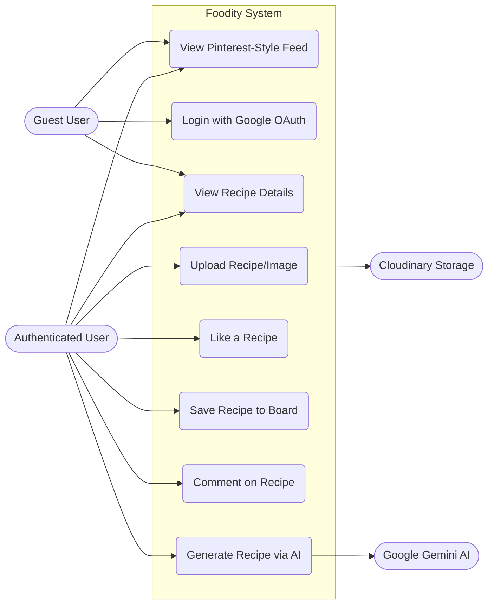
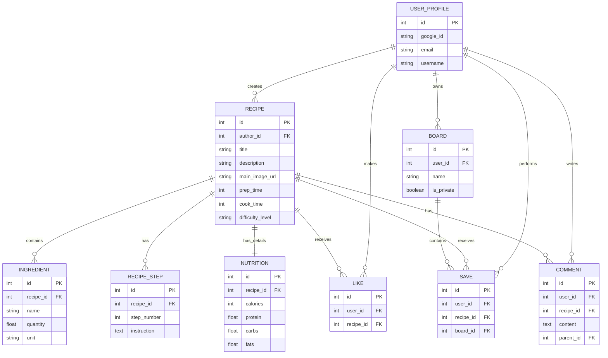

# Foodity System Design and Architecture

## 1. System Requirements & DevOps Methodology

Unlike traditional Waterfall development models (which flow strictly from Requirement Analysis -> System Design -> Implementation -> Testing -> Deployment -> Maintenance), the development of Foodity follows a **DevOps and Agile** methodology. This allows for continuous iteration, rapid deployment, and frequent improvements.

### Our DevOps Stages:
1. **Planning & Setup (Requirements & Design):** Defining the architecture, selecting the tech stack (React, Django, MySQL), and setting up the project scaffold. We prioritize data structure and clear architectures.
2. **Continuous Development (Implementation):** Iterative development focusing on small, frequent releases. For example:
   * *Release 1:* Project scaffold, Database schema, Dataset importer
   * *Release 2:* Feed UI, Recipe Cards
   * *Release 3:* Authentication, Save and Like
3. **Continuous Integration & Testing:** Writing unit tests for Django models and API endpoints. Testing is integrated directly into the workflow to ensure code stability before merging features.
4. **Continuous Deployment (CD):** Deploying the application seamlessly. The Django backend is configured for environments like Render/Railway, and the React frontend is deployed using Vercel. Code pushes to the main Git branch trigger automated builds.
5. **Continuous Monitoring & Maintenance:** Monitoring server performance, analyzing logs to resolve issues, and scaling the MySQL database or API resources as user traffic increases.

---

## 2. System Design Diagrams

### 2.1 Use Case Diagram
This diagram shows the core interactions between different actors (Guest, Authenticated User, External Systems) and the Foodity platform.



### 2.2 Data Flow Diagram (DFD - Level 1)
This diagram illustrates how data consistently moves through the Foodity system, from the frontend client to various backend services.

```mermaid
graph TD
    Client[Client / Web Browser] -->|HTTP REST Requests| API[Django Backend API Gateway]
    
    API <-->|Read/Write Data| DB[(MySQL Database)]
    API <-->|Verify OAuth Token| GoogleOAuth[Google Auth Provider]
    API -->|Send Image Payload| Cloudinary[Cloudinary Storage]
    Cloudinary -->|Return Image URL| API
    
    API -->|Send Ingredients| Gemini[Google Gemini AI]
    Gemini -->|Return Generated Recipe Data| API

    Client <--|JSON Data Responses| API
```

### 2.3 Entity-Relationship (ER) Diagram
This diagram represents the relationships between the backend models that enforce Foodity's clean structured data.



---

## 3. Database Tables

Below are the expanded definitions for the MySQL tables supporting Foodity based on our Django models.

### `UserProfile`
| Field | Type | Description |
|---|---|---|
| `id` | Primary Key | Auto-incrementing ID |
| `google_id` | String | Google OAuth subject ID |
| `email` | String | User's email address |
| `username` | String | Display name |

### `Recipe`
| Field | Type | Description |
|---|---|---|
| `id` | Primary Key | Auto-incrementing ID |
| `author_id` | Foreign Key | References `UserProfile(id)` |
| `title` | String | Recipe title |
| `main_image` | String | Cloudinary URL for main thumbnail |
| `description` | Text | Short summary of recipe |
| `servings` | Integer | Number of servings |
| `preparation_time` | Integer | Prep time in minutes |
| `cooking_time` | Integer | Cooking time in minutes |
| `total_time` | Integer | Total time in minutes |
| `difficulty_level` | String | E.g., Beginner, Intermediate, Expert |

### `Ingredient`
| Field | Type | Description |
|---|---|---|
| `id` | Primary Key | Auto-incrementing ID |
| `recipe_id` | Foreign Key | References `Recipe(id)` |
| `ingredient_name` | String | Name of the ingredient |
| `quantity` | Float | Amount of ingredient (e.g., 2.5) |
| `unit` | String | Measurement unit (e.g., grams, cups, tbsp) |

### `RecipeStep`
| Field | Type | Description |
|---|---|---|
| `id` | Primary Key | Auto-incrementing ID |
| `recipe_id` | Foreign Key | References `Recipe(id)` |
| `step_number` | Integer | Ordering of the step (1, 2, 3...) |
| `instruction_text`| Text | Detailed step instruction text |

### `Nutrition`
| Field | Type | Description |
|---|---|---|
| `id` | Primary Key | Auto-incrementing ID |
| `recipe_id` | Foreign Key | References `Recipe(id)` (One-To-One) |
| `calories` | Integer | Total calories per serving |
| `protein` | Float | Protein in grams |
| `carbs` | Float | Carbohydrates in grams |
| `fats` | Float | Fats in grams |

### `Board`
| Field | Type | Description |
|---|---|---|
| `id` | Primary Key | Auto-incrementing ID |
| `user_id` | Foreign Key | References `UserProfile(id)` |
| `name` | String | Board title (e.g., "Dinner Ideas") |
| `is_private` | Boolean | Visibility (Public/Private) |

### `Like`
| Field | Type | Description |
|---|---|---|
| `id` | Primary Key | Auto-incrementing ID |
| `user_id` | Foreign Key | References `UserProfile(id)` |
| `recipe_id` | Foreign Key | References `Recipe(id)` |

### `Save`
| Field | Type | Description |
|---|---|---|
| `id` | Primary Key | Auto-incrementing ID |
| `user_id` | Foreign Key | References `UserProfile(id)` |
| `recipe_id` | Foreign Key | References `Recipe(id)` |
| `board_id` | Foreign Key | References `Board(id)` |

### `Comment`
| Field | Type | Description |
|---|---|---|
| `id` | Primary Key | Auto-incrementing ID |
| `user_id` | Foreign Key | References `UserProfile(id)` |
| `recipe_id` | Foreign Key | References `Recipe(id)` |
| `parent_id` | Foreign Key | Self-referencing ID for one-level replies (Nullable) |
| `text` | Text | Comment payload |
